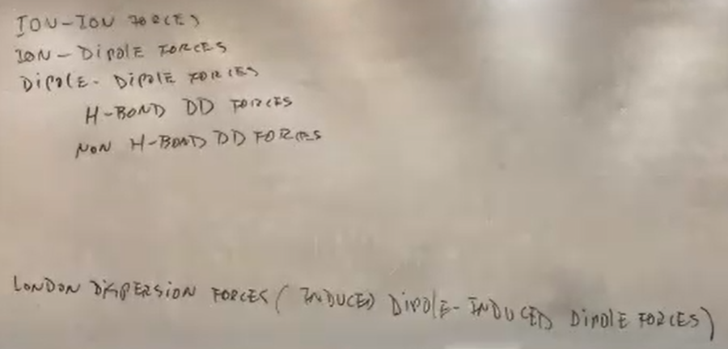

London Dispersion forces are about the electron cloud, the
bigger the cloud, the stronger the london dispersion forces,
the easier you can distort the electron cloud

How easy you can generate this dipole, and
intermolecular force comparison
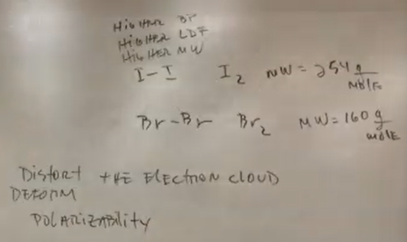
The higher the molecular weight, the
higher the polarizability

Iron will attach to the oxygen via Ion-
Induced Dipole forces
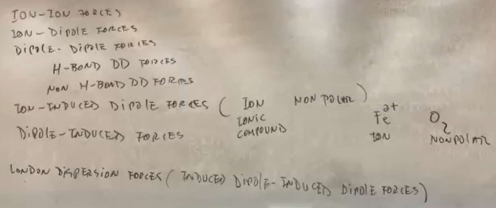

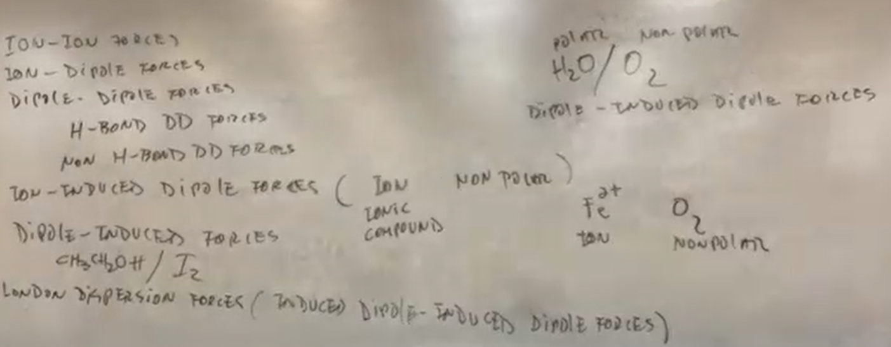
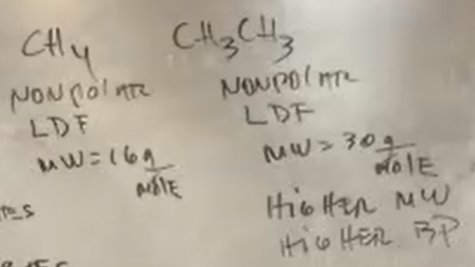
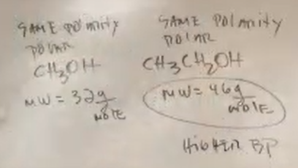

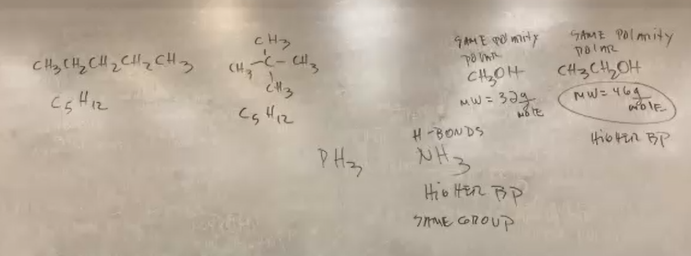
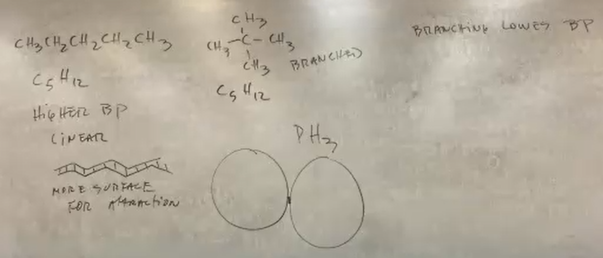

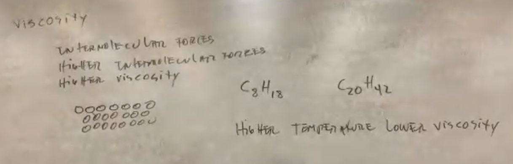

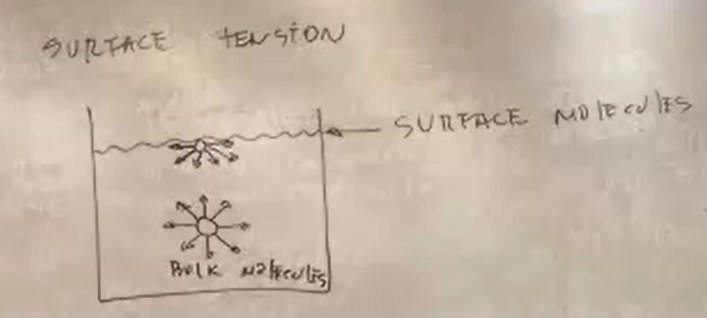
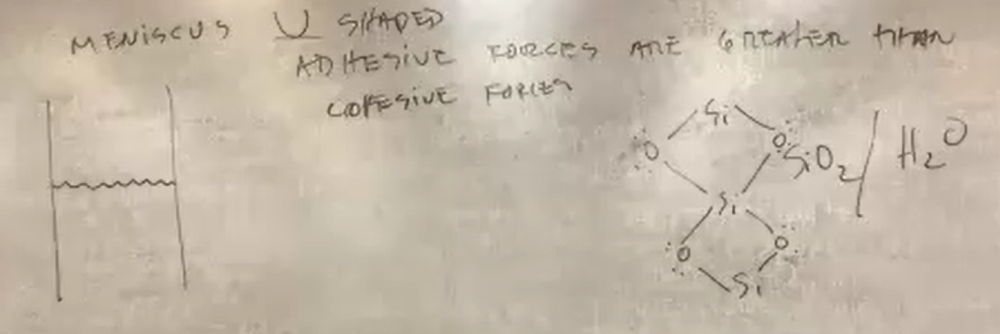
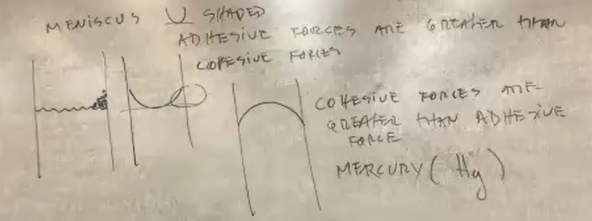

