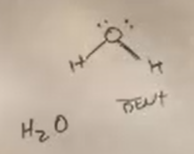
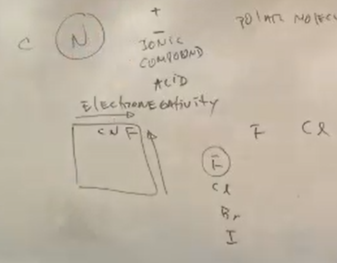
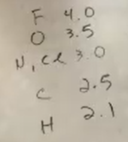
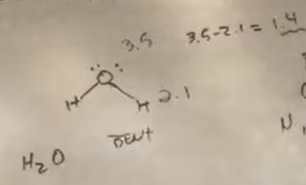
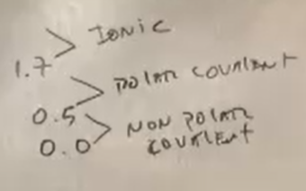

Know if a molecule is polar or nonpolar

Intermolecular forces and Intramolecular forces

They are electrostatic in nature

Inter
- In between molecules
- Forces of attraction between two
different molecules, they have to do
with the charge of the molecules

Intra
- Within molecules
- Bonding Forces
  - Ionic
  - Covanlent Bonds
    - Polar Covalent
    - Non Polar Covalent
- Stronger than Inter
- Ionic bonds are stronger than a covalent,
a full positive and full negative will always
be a stronger attraction than a partial positive
and partial negative

Intermolecular Forces
- Ion-Ion forces (Ionic bonds)
  - NaCl, KCl, CaF\(_2\), Metal(+)Non Metal(-)
- Ion-Dipole Forces
  - A dipole, two poles, one positive, one negative, 
  it's not full positive, so we can call it delta
  positive and delta negative, since it has
  two poles, it's polar
  - (+-) Positive or Negative Ionic Compound or Acid,
  because an Acid can dissociate in water to form ions

There is a difference in electronegativity between
hydrogen and oxygen, oxygen is more electronegative,
electronegativity is referring to withdraw electron
density in a bond, the halogens dont form bonds,
fluorine is the most electro negative element on
the periodic table, electronegativity increases
from left to right and bottom to top on the
periodic table

Electronegativity levels, debuys? are the unit,
here are some elements and their electronegativity
level

How polarized a bond is

Ways to classify molecules based on bond
electronegativity

Since the oxygen is more electronegative in
the molecule, it is the negative pole and
since the hydrogen is less electronegative,
it is the positive pole, therefore the
molecule is polar covalent
