Intermolecular Forces
  - Ion-Ion Forces
    - Still a force of attraction between two things
  - Ion-Dipole Forces
    - You need an Ion, positive or negative
    - And a polar molecule, so one side is negative
    and the other side is positive, they aren't fully
    positive or negative, they are partially positive
    and negative, so we say delta, which means partial,
    so we will have a delta positive and delta negative
    side on the molecule
    - The positive part of the molecule could be a
    cation, a positive ion, so one side of the polar
    molecule is going to be oriented towards that
    positive ion

The electron geometry or domain of water is tetrahedral,
it has a bond angle of less than 109.5, it's hybridization
is Sp3

Whenever a bond is polar covalent and is not symmetrical
it means that dipole did not cancel out, and this whole
molecule will have something called the result dipoles,
which is called a dipole moment

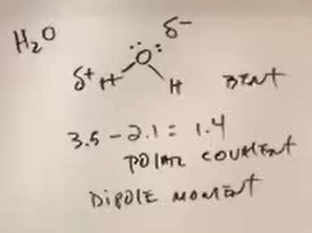

Everytime you see oxygen, it will be polar, unless
it's symmetrical

Oxygen is non-polar because it has a plane of symmetry,
anything that is x\(_2\) is non-polar

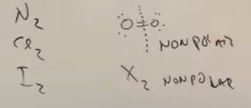

Symmetrical vs Non-Symmetrical
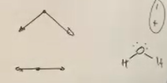

Anything composed of carbons and hydrogens will
always be non-polar

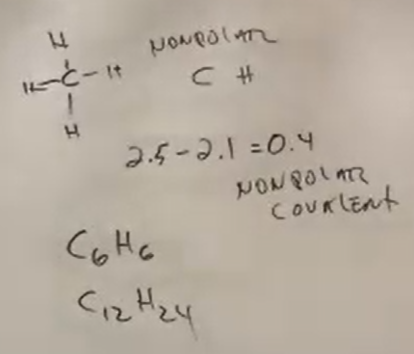

Oxygen is always partial negative, because it is the
second most electronegative element on the period
table

A molecule can have both a polar and non-polar side
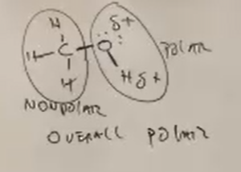
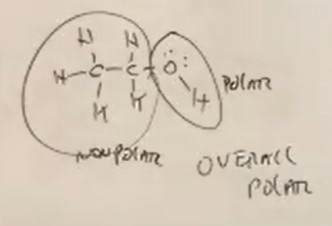
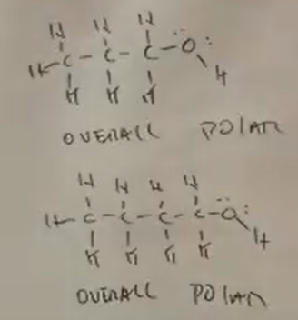

Eventually the non-polar side will be dominant
when the ration of 4 carbons to 1 oxygen is exceeded

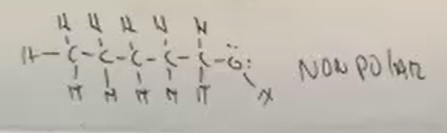

##### 4 Carbon : 1 Oxygen

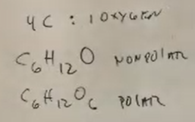

Nitrogen is also the same as oxygen in that case,

More examples,
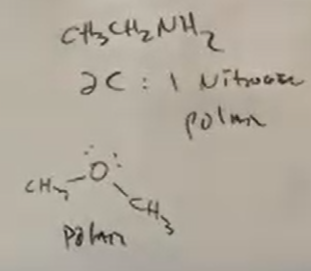

Things can be really non-polar, really polar, slightly
polar, etc.
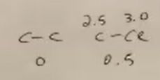

Everytime you see a carbon attatched to 4 halogens,
it will be non-polar because it is symmetrical
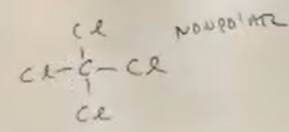

If it doesn't, it can be polar
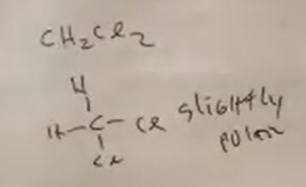

These are both polar, but one has a non-polar
side (left)
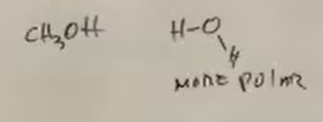

#### Dipole moments show you polarity
Let's say, substance x has a dipo moment of 0.8 dbuy,
and another, y, with one of 1.9, the second would be
more polar because it has a higher dipo moment
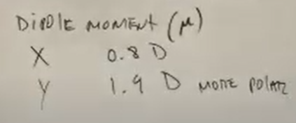

If we had a sodium molecule and water molecules, the
negative side of the water molecules, oxygen, would
align towards the sodium, as sodium is positive

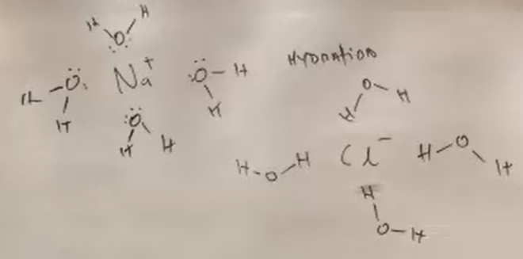

Hydration is when water surrounds an Ion, if we
had a negative chlorine, the positive part of the
water would align towards it, the hydrogen, so this
occurs for both positive and negative ions

If you have a solvent surrounding an ion, it would
be solvation, so the process when anything surrounds
something else and it's a solve, we don't know if it's
water, methanol, or anything else, specifically when
it's water, it's hydration
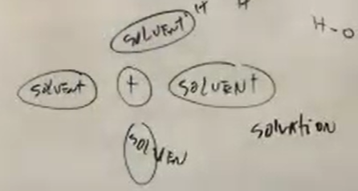

Ion / Molecule
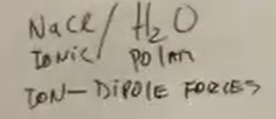

Metal with Non-Metal is Ionic
Non-Metal with Non-Metal is Ionic

Ion / Molecule
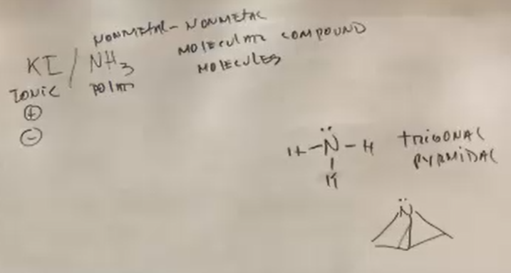

Ion Dipole Forces
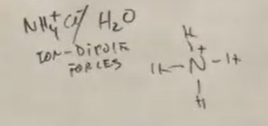

Hydrogen Bond, not a bonding force, an intermolecular
force
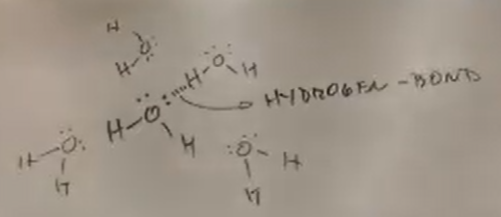

All intermolecular forces are weak, but within these
weak forces, hydrogen bonds are strong

You will have a hydrogen bond when you have a
**hydrogen** directly attatched to **FON**

- Fluorine
- Oxygen
- Nitrogen

CH\(_3\)F does not make hydrogen bonds as the F
does not attatch to the H
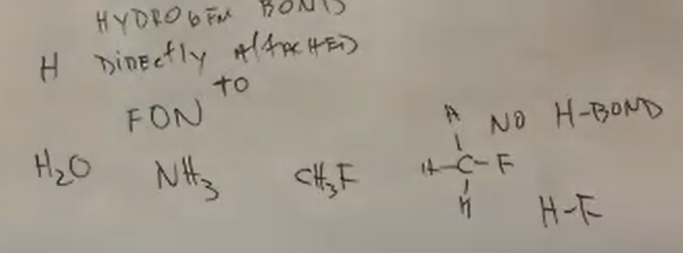

#### Boiling Point
is an indication of the strength of intermolecular
forces, the stronger the intermolecular forces, the
higher the boiling point

To compare the boiling point of two substances, say first
whether they are ionic, polar, or nonpolar, then write,
what's the strongest force between them, and then we know
which one has the higher boiling point
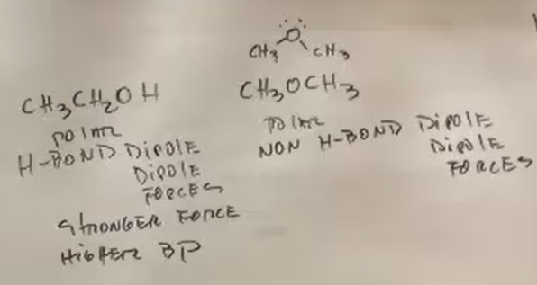

Instantaneous dipole / induced dipole, a temporary dipole
that spreads across the molecule

A normal polar molecule dipole is permanent
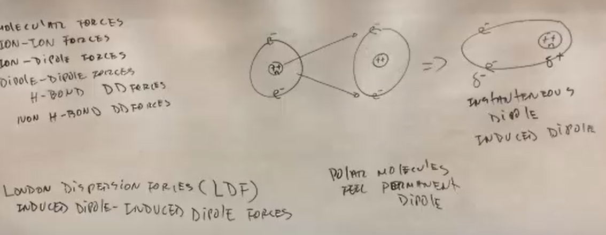
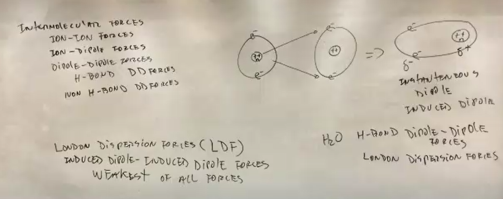

All molecules feel london dispersion forces

The london dispersion force is the strongest when you are
talking about non-polar molecules, ldf are about electron
cloud and bigger molecules have more electrons so they
can have stronger ldf
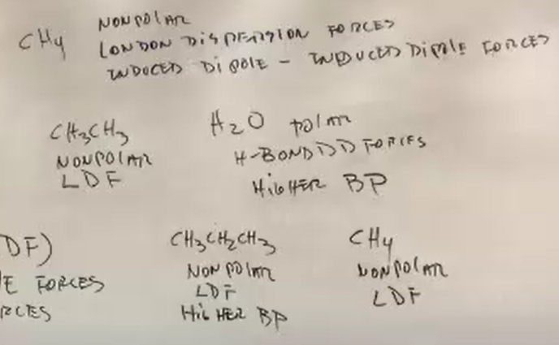
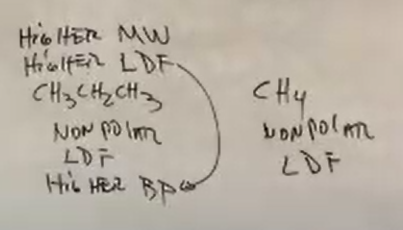