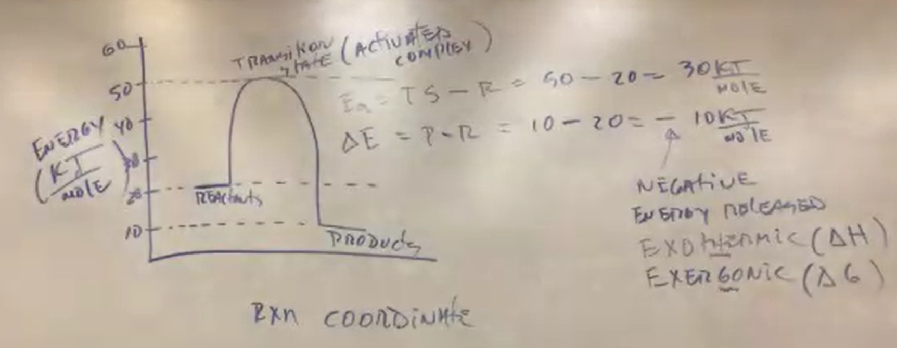
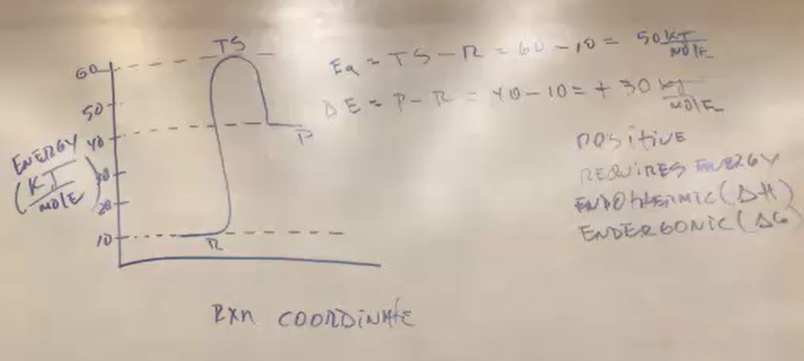
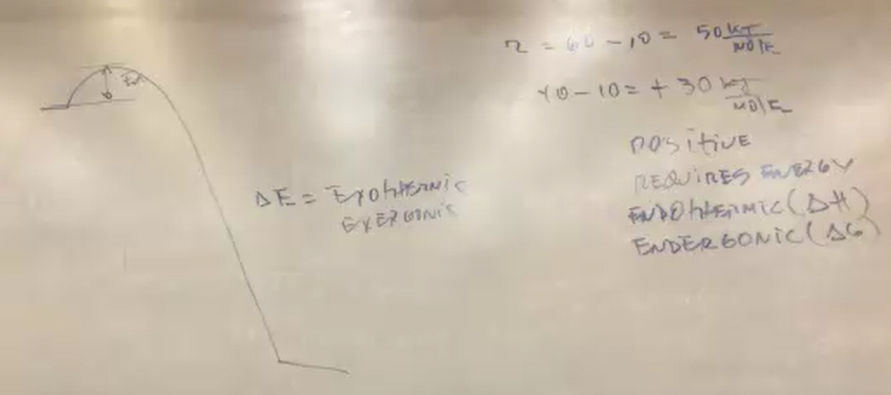
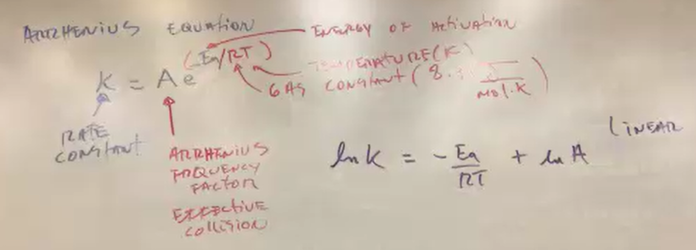
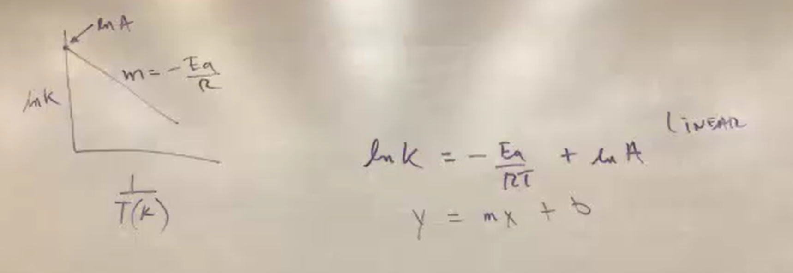
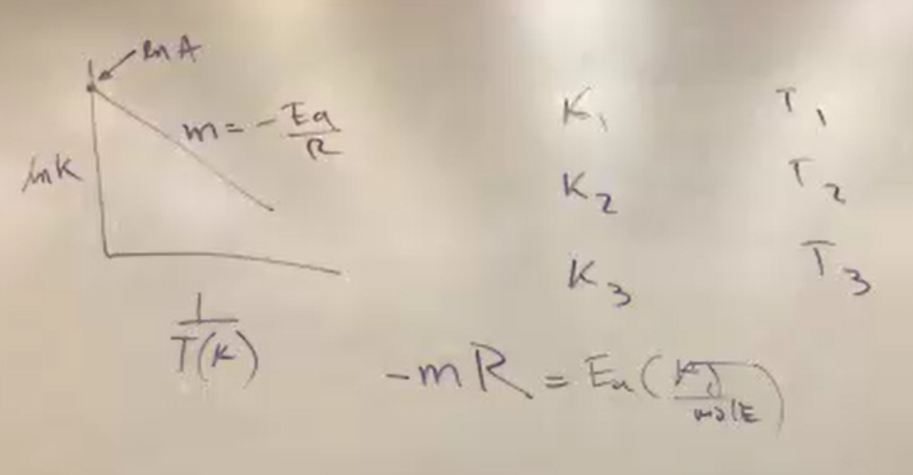
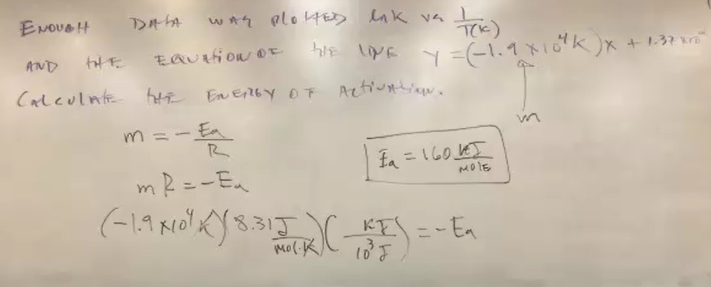
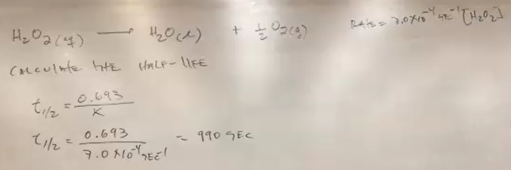
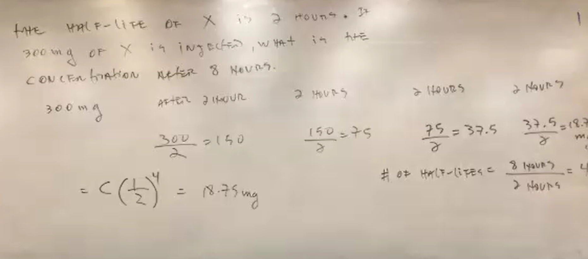
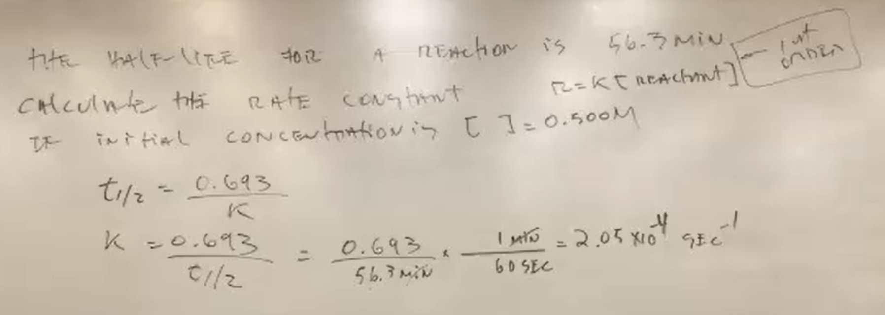

https://chatgpt.com/c/67bf5918-89e0-800f-a753-2619d017bbb2

explain what is on the image and what the concepts involved are and what kind of problems it is trying to solve, explain it simply step by step, leave nothing up to interpretation or assumption for me

