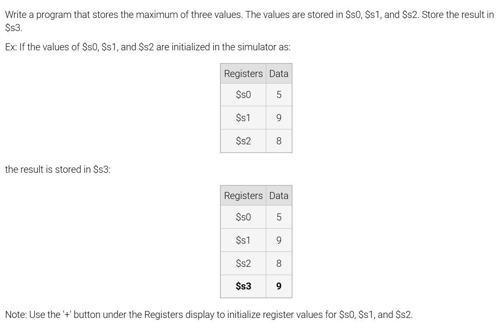
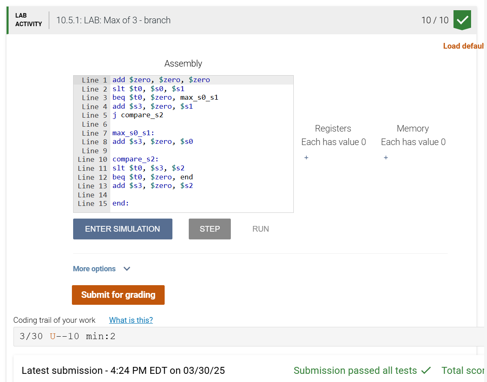

### 10.5 LAB: Max of 3 - branch




```asm
add $zero, $zero, $zero
slt $t0, $s0, $s1
beq $t0, $zero, max_s0_s1
add $s3, $zero, $s1
j compare_s2

max_s0_s1:
add $s3, $zero, $s0

compare_s2:
slt $t0, $s3, $s2
beq $t0, $zero, end
add $s3, $zero, $s2

end:```