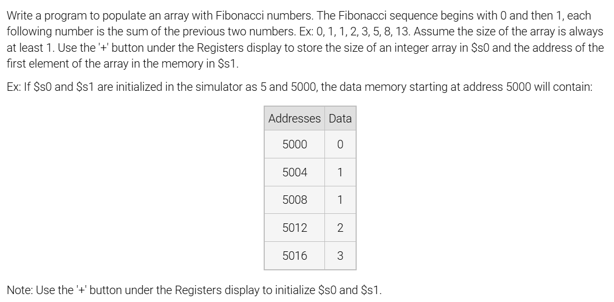
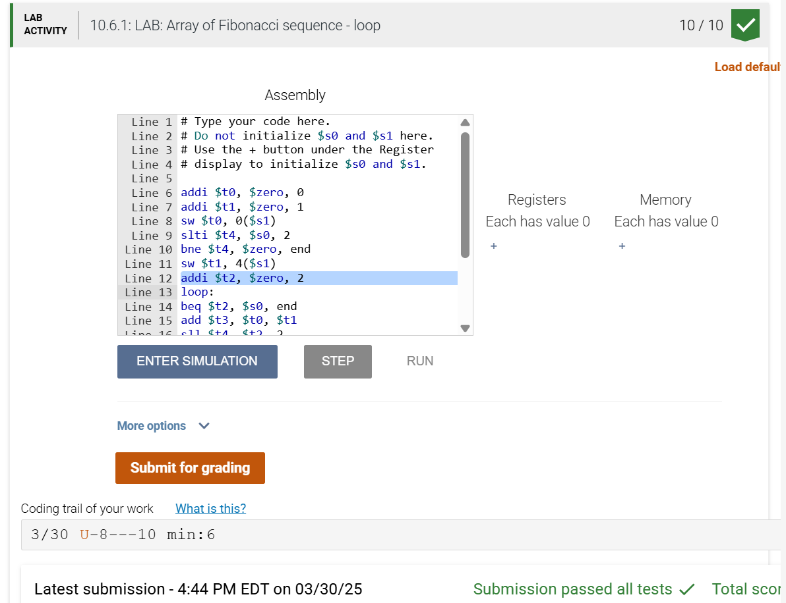

### 10.6 LAB: Array of Fibonacci sequence - loop




```asm

addi $t0, $zero, 0
addi $t1, $zero, 1
sw $t0, 0($s1)
slti $t4, $s0, 2
bne $t4, $zero, end
sw $t1, 4($s1)
addi $t2, $zero, 2
loop:
beq $t2, $s0, end
add $t3, $t0, $t1
sll $t4, $t2, 2
add $t4, $s1, $t4
sw $t3, 0($t4)
add $t0, $zero, $t1
add $t1, $zero, $t3
addi $t2, $t2, 1
j loop
end:```
