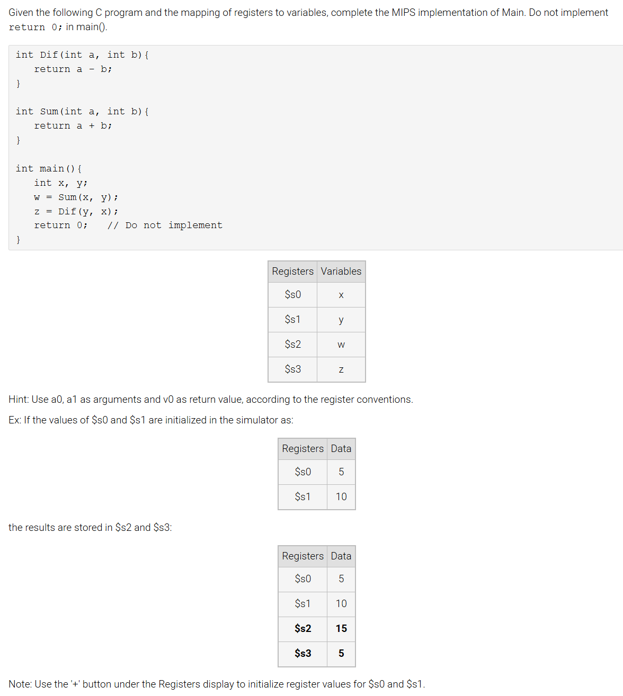

### 10.9 LAB: Procedure calls



```asm
Main:
      # Type your code here.
      move $a0, $s0
      move $a1, $s1
      jal Sum
      move $s2, $v0
      
      move $a0, $s1
      move $a1, $s0
      jal Dif
      move $s3, $v0
      
      j End

# Procedure Sum (Do not modify)
Sum:
      add $v0, $a0, $a1
      jr $ra

# Procedure Dif (Do not modify)
Dif:
      sub $v0, $a0, $a1
      jr $ra

End:
```

