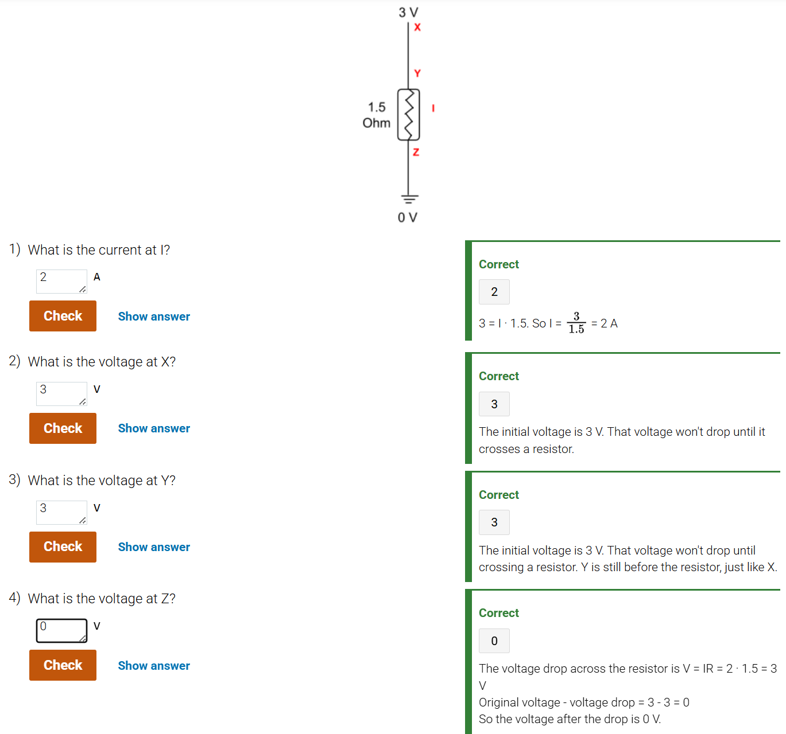

### Electronics and digital systems
**Voltage** is the potential for charge to move. **Voltage** is measured in **volts**.
**Current** is the amount of charge flow. **Current** is measured in **amps**.
**Resistance** is a wire's opposition to flow. **Resistance** is measured in **ohms**.

