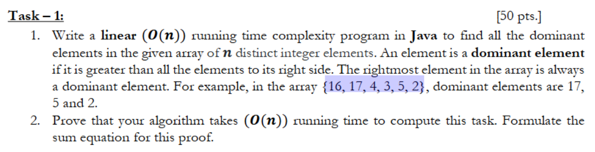
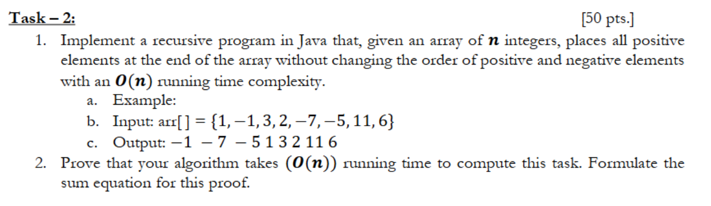

##### By Pablo Valdes; 1/17/25

---



---

```java
import java.util.ArrayList;

class Main {
    public static void main(String[] args) {
        int[] arr = {16, 17, 4, 3, 5, 2};
        findDominantElements(arr);
    }
    
    static void findDominantElements(int[] nums) {
        ArrayList<Integer> result = new ArrayList();
        int max = nums[nums.length-1];
        result.add(max);
        
        for (int i = nums.length-1;i >= 0; i--) {
            if (nums[i] > max) {
                max = nums[i];
                result.add(max);
            }
        }
        
        System.out.println(result);
    }
}
```

Let's analyze our `findDominantElement` function, step by step in Java,

Initializing ArrayList, __*1 unit of time*__
Init max variable, __*1 unit of time*__
Add to result, __*1 unit of time*__

For loop which goes through input linearly in reverse
Constant time, if statement, let's say __*2 units of time*__
for what's done inside the if statement, still it's
constant

The for loop can be expressed as a summation with our constant \(2\),

\[
\sum^{n}_{i=1}2
\]
Using this formula for adding constant summations,
\[
\sum^{n}_{i=1}c=c*n
\]
We can analyze our time complexity, let's say when \(n = 6\), so when our
input array is of length \(6\),
\[
\sum^{6}_{i=1}2 = 2 * 6 = 12
\]
Then we can see that the loop has __*12 units of time*__ occurring,
or more specifically, **2n** units of time for any input, **n**, as the
loop is iterativing linearly, even as it's moving in reverse order

And then we simply print our arraylist of values, which is __*1 unit of time*__

---

Therefore, the total time complexity would be,
\[
O(1+1+1+2n+1)
\]
Which can be simplified to,
\[
\implies O(n)
\]

<!-- \[
\frac{n(n+1)}{2} \rightarrow \frac{6(6+1)}{2} \rightarrow \frac{6(7)}{2} \rightarrow \frac{42}{2} \rightarrow 21
\] -->

---



---

``` java
static int[] shiftValues(int[] arr, int lastNegativeIndex, int currentIndex) {
	    if (currentIndex == arr.length) {
	        return arr;
	    }
	    
	    if (arr[currentIndex] < 0) {
	        
	        int negativeValue = arr[currentIndex];
	        
	        for (int i = currentIndex; i > lastNegativeIndex; i--) {
	            arr[i] = arr[i-1];
	        }
	        
	        arr[lastNegativeIndex] = negativeValue;
	        
	        shiftValues(arr, lastNegativeIndex+1, currentIndex+1);
	        
	    } else {

	        shiftValues(arr, lastNegativeIndex, currentIndex+1);
	    }
	    return arr;
    }
```

---

In our recursive Java code solution, we have some constant operations,
our base case and if statement both check values, these run in constant
time, assigning our negative value to our array index is also constant,
as is our other assignment, these are all constant and for now can
be ignored for the time complexity analysis

Our recursive algorithm is really running a linear call stack to achieve
\(O(n)\), time complexity, the area of interest however is our for loop,
this for loop is swapping positive values to the right, which overwrite
the encountered negative value there, this creates space to insert the
negative value where a positive once was, this operation can vary based
on the space between where we want to create an opening on the left for
a negative and where the negative we just encountered is, there is a given
amount of variables between those two spaces, that must be swapped through to
the right to create our desired opening on the left, our bottleneck here is
essentially our **distance** between the negative placement on the left, and
the positive numbers we must shift to the right in order to free that placement
for the negative number encountered

It's important to note that we have two branches of recursion here, one where we
encounter a negative value, and must perform our for loop to make space to add it
on the left, and the other where we encounter a positive number and just continue, 
the second is of constant time, the second, we can represent with sum notation

``` java
for (int i = currentIndex; i > lastNegativeIndex; i--) {
	arr[i] = arr[i-1];
}
```

*__*last negative index*__ is a placeholder for where the next negative should
be placed, whereas __*current index*__ is in this case, where a negative number
has been encountered*

\[
\sum^{currentIndex}_{i = lastNegativeIndex + 1}
\]

For simplicity, let's just call this distance, \(d_j\), \(_j\) being the current negative
element position being processed and \(d\) being the distance,

\(d_j\) = \(currentIndex - lastNegativeDistance\)
\(d_j\) = \(k - j\)

It's also important to note that the cost of shifting across the distance
does not exceed n; the total costs of shifting:

*__*k*__ is the currently encountered negative, we want to shift the
positives towards the __*j*__ index fill it's position, so we have an
opening at j to put our encountered negative on the left*

\[
Shifting Cost = \sum^{k}_{j=1}d_j<=n
\]

To model the full complexity of our algorithm, we will take into account both
cases of the recursion, which can be modeled with the recurrence relation,

\[
T(n) = 
\begin{cases} 
      O(1) & \text{if } n = 0 \\
      T(n-1)+d_j & \text{if } arr[n] \text{ is negative} \\
      T(n-1) + O(1) & \text{if } arr[n] \text{ is positive}
\end{cases}
\]

Which we can simplify this to,
\[
T(n) = T(n-1) + O(1) + O(d_j)
\]

We can prove our overall time complexity with a summation of the
entire function and it's recursive parts, for the entire processing
of the function, it's,

\[
\sum^{n}_{i=1}O(1)
\]

and with the total cost of shifting as previously stated, the total time
complexity is,

\[
T(n)=\sum^{n}_{i=1}O(1)\sum^{k}_{j=1}O(d_j)
\]

Which when evaluated is,

\[
\sum^{k}_{j=1}O(d_j)<=O(n)
\]
\[
\sum^{n}_{i=1}O(1)=n*O(1)=O(n)
\]

Therefore,

\[
T(n) = O(n) + O(n)
\]
\[
T(n) = O(2n)
\]
\[
\implies O(n)
\]