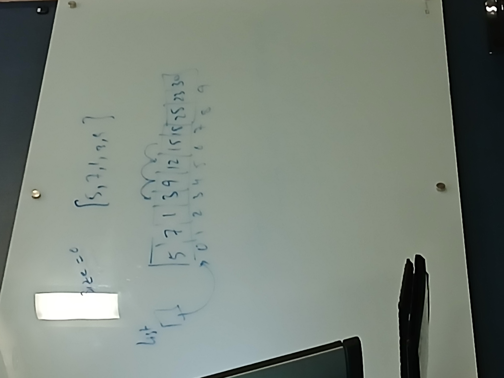

Array List
1. arrayList is not a data structure, it is a class that provides methods to manipulate array
2. Instance variables
  - a. Size - number of lemenets in the list
  - b. Default Capacity - how much eleents list can store
  - c. Array - to store the generic data elements
3. Methods
  - a. Empty - list is empty if the size is 0
  - b. Size - returns the size of list
  - c. Clear - setting list to default, size is zero and capacity is default capacity
  - d. Add(data) - add the data element at the end of the list
  - e. Add(index, data) - add data element at the given index
  - f. Remove() - removes data element from the end of the list
  - g. Remove(index) - removes data from the given index
  h. Get(index) - returns the data at given index
  - i. Set(index, data) - update the given index with data
  - j. Count() - returns the number of data elements
  - k. Contains(data) - reports whether the provided data element belongs to the list
  - l. toString() - returns the string representation of list

  

### ArrayList.java
```java
public class ArrayList <AnyType>{
	public final static int CAPACITY = 10;
	private int size;
	private AnyType[] items;
	
	public ArrayList( ) {
		clear();
	}
	
	public ArrayList(int capacity) {
		size = 0;
		items = (AnyType[])new Object[capacity];
	}
	public void clear() {
		size = 0;
		items = (AnyType[])new Object[CAPACITY];
	}
	public int size() {
		return size;
	}
	
	public boolean isEmpty() {
		return size() == 0;
	}
	
	//method
	private void ensureCapacity(int capacity) {
		if(capacity < size)
			return;
		AnyType[] temp = (AnyType[]) new Object[capacity];
		for(int i = 0; i < size(); i++)
			temp[i] = items[i];
		items = temp;
		
	}

	public void add(AnyType data) {
		add(size(),data);
	}
	
	public void add(int index, AnyType data) {
		if(index < 0 || index > size()-1) // make sure valid index, size is one great the actual list, so minus 1
			throw new IndexOutOfBoundsException("Invalid Index");
		if(items.length == size()) // to make sure if there is space to add element
			ensureCapacity(size() * 2);
//		for(int i = index; i < size(); i++)
//			items[i+1] = items[i];
		// shift all elements right from target
		for(int i = size(); i > index; i--)
			items[i] = items[i-1];
		items[index] = data;
		size++;
	}
	
	public void remove(int index) {
		if(index < 0 || index > size()-1) // make sure valid index
			throw new IndexOutOfBoundsException("Invalid Index");
		for(int i = index; i < size(); i++)
			items[i] = items[i+1];
		size--;
	}
	
	public void remove() {
		remove(size()-1);
	}
	
	public void removeAll() {
		clear();
	}
	
	public AnyType get(int index) {
		if(index < 0 || index > size()-1) // make sure valid index
			throw new IndexOutOfBoundsException("Invalid Index");
		return items[index];
	}
	
	public void set(int index, AnyType data) {
		if(index < 0 || index > size()-1) // make sure valid index
			throw new IndexOutOfBoundsException("Invalid Index");
		items[index] = data;
	}
	
	public int count() {
		return size();
	}
	
	public boolean contains(AnyType value) {
		for(int i = 0; i < size(); i++)
			if(items[i].equals(value))
				return true;
		return false;
	}
	
	public String toString() {
		if(isEmpty())
			return "[]";
		String str = "[";
		for(int i = 0; i < size()-1; i++)
			str = str + items[i] + ", ";
		return str + items[size()-1] + "]";
	}
	
}

```


### main.java
```java

// filename called test during data structures class
public class main {

	public static void main(String[] args) {
		// TODO Auto-generated method stub
		System.out.println("yo");
		ArrayList<Integer> list = new ArrayList<>();
		list.add(5);
		list.add(87);
		list.add(1,20);
		list.add(100,20); // throws exception (error)
		list.add(-1,2); // throws exception (error)
		System.out.println(list);
		
		list.remove();
		System.out.println(list);
		
		list.set(3,19);
		System.out.println(list);
	}

}

```